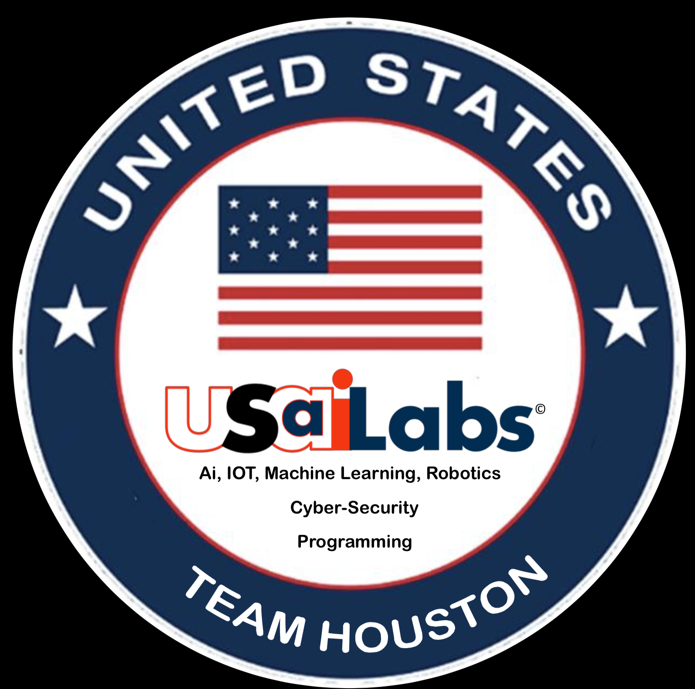

# USAiLabs Main Page

## Our Mission 🚀
We organize collaborative work sessions so anyone can build skills in emerging computer technology, especially Ai, IOT, Machine Learning, Robotics, Cyber-Security, Programming.

## Vision Statement & History ⭐
Based in Houston, TX. USAiLabs was created in 2019 to address the pent up demand for Ai, IOT, Machine Learning, and Robots.  We   innovate, tinker, educate, consult, research, and develop to awaken the American Competitive Spirit to innervate “Good ‘Ol Yankee Ingenuity”. This is the heart of harnessing TECH DIY (from the teaching, learning and R&D perspective).

We grew out of the Houston Robots club.  We changed the name to set up a non-profit organization and broaden our scope to include a wider range of emerging computer technologies.

## Collaborative Work Sessions - Times and Locations 💻
Due to the pandemic we have paused our in-person sessions, we host a virtual meeting every Saturday from 11 AM until 2 PM. The link to the meeting announcements is located on Meetups:
https://www.meetup.com/USAi-Labs-formerly-Houston-Robotics-AI-ML-Robotics-IoT/

## Become a Member! ✔️
Listserv: Email us at contact@usailabs.org to get added to our email listserv
Join our [Slack Community](https://join.slack.com/t/usailabs/shared_invite/zt-tgr85pbm-yALQ9AU5kctfe2AHjqsagA)!
Our Github: https://github.com/USAiLabs
LinkedIn: https://www.linkedin.com/groups/12258074/

## Our Wiki 🧠
Check out our [Github Wiki](https://github.com/USAiLabs/main/wiki)
* Learning Resources
* Current Projects
* Past Projects

## Contact us 
* Feel free to email contact@usailabs.org for any other additional questions or ideas to collaborate on!
